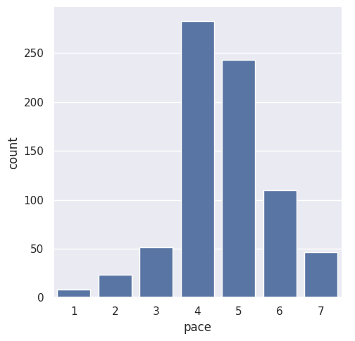
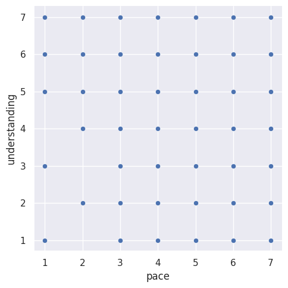
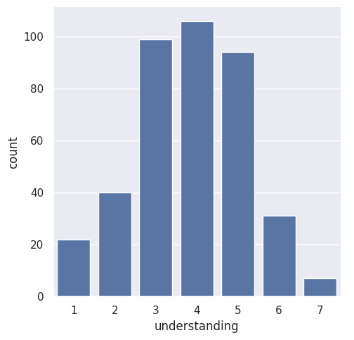

---
# Do not edit the text between these lines!
layout: default
---
# COMP110 Data Analysis: Course Pacing and Student Understanding

## Summary of Analysis

For this project, I analyzed anonymized survey data collected from COMP110 students to explore whether course pacing affects student understanding. My idea was that the course should adjust its pacing for students who find it moving too quickly, because it will create value for enrolled students who feel lost and are at risk of falling behind.

I used Python utility functions to load and filter the survey data, focusing on two columns: `pace` (how fast students perceive the course moving, rated 1-7) and `understanding` (how well students feel they understand the material, rated 1-7).

## Visualizations

## Conclusion

Our analysis of the survey data supports the idea that course pacing should be adjusted for students who find it moving too quickly.

The data showed a clear negative relationship between perceived pace and understanding. Students who rated the course as moving faster tended to report lower understanding of the material. Among students who rated the pace at 5 or higher, most clustered around understanding ratings of 3, 4, and 5, with very few reporting high understanding of 6 or 7.

Based on these findings, the course should introduce more pacing flexibility. This could include offering optional slower-paced review sessions, spacing out new concept introductions, or providing checkpoints where students can self-assess before moving on.